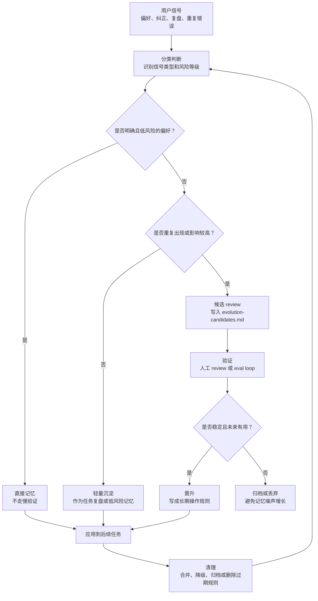

# Self-Improving Skills

> 一个自我进化 skill：把用户纠正、偏好、任务复盘、重复错误和工作流经验，沉淀成 Agent 可持续使用的操作知识。

中文 | [English](README.en.md)

Self-Improving Skills 是一个单独的 skill 包，目标是让 Agent 不只是完成当前任务，而是能从真实使用中持续改进。

它提供一套清晰的进化闭环：

```text
捕捉信号 -> 分类判断 -> 风险分级 -> 存储 -> 低风险自动晋升 -> 高风险等待确认 -> 清理过期规则
```

它支持 Codex、Claude Code、OpenClaw，以及其他能够加载本地 `SKILL.md` 指令的 Agent 环境。

---

## 解决什么问题

很多 Agent 并不会真正从经验中进化：

- 用户偏好说过一次，过几天就忘。
- 用户纠正只修复当前回答，不影响未来行为。
- 重复错误一直出现，因为没有被晋升成规则。
- 任务总结只写做了什么，没有提炼下次怎么做。
- 触发词越加越多，但旧的、噪声大的触发词没有被清理。
- 记忆文件越来越乱，因为所有信息都被放在同一个层级。

Self-Improving Skills 帮 Agent 判断：

- 什么应该立刻记住。
- 什么只能先放进候选区。
- 什么可以安全自动晋升。
- 什么必须等人确认。
- 什么应该归档或清理。

---

## 设计思想：借鉴 Karpathy 的 Software 3.0 / LLM OS 思路

Self-Improving Skills 的底层思路，借鉴了 Andrej Karpathy 关于 Software 3.0 / LLM OS 的判断，也参考了 Anthropic、LangChain 等团队关于 context engineering 的讨论：在大模型时代，Agent 的行为不只由传统代码决定，也越来越由自然语言指令、上下文、工具、记忆、例子、反馈、验证和清理机制共同决定。

换句话说，Agent 真正的「程序」不只是一句 prompt，而是它周围的上下文系统：

```text
instructions + memory + tools + examples + feedback + evals + pruning
```

Self-Improving Skills 做的事情，就是把这个思路落成一个可执行的 skill：

- 把 context 当成可维护的运行时，而不是聊天记录的堆积。
- 把用户反馈变成结构化操作知识。
- 低风险经验可以自动晋升。
- 把重复错误变成可验证的候选规则。
- 把触发词当成需要治理的接口，而不是无限追加关键词。
- 对高影响规则保留人工确认，不让 Agent 自动乱升级。

这不是 Karpathy、Anthropic、LangChain 或 Shopify 参与或背书的项目，而是借鉴这些公开讨论里的工程视角：在 Software 3.0 时代，改进 Agent 的关键，不只是写更长的 prompt，而是工程化管理它的上下文、记忆、工具、反馈闭环、验证面和清理机制。

参考：

- Andrej Karpathy, [Software Is Changing (Again)](https://www.youtube.com/watch?v=LCEmiRjPEtQ), YC AI Startup School.
- Andrej Karpathy, [Software 2.0](https://karpathy.medium.com/software-2-0-a64152b37c35).
- Tobi Lutke, [context engineering over prompt engineering](https://x.com/tobi/status/1935533422589399127).
- Anthropic, [Effective context engineering for AI agents](https://www.anthropic.com/engineering/effective-context-engineering-for-ai-agents).
- LangChain, [Context Engineering for Agents](https://www.langchain.com/blog/context-engineering-for-agents).
- LangChain, [How agents can use filesystems for context engineering](https://www.langchain.com/blog/how-agents-can-use-filesystems-for-context-engineering).

---

## 它能做什么

| 能力 | 处理什么 | 输出 |
|---|---|---|
| 直接记忆 | 用户明确说“记住”“以后都”“我的风格是” | 稳定用户记忆 |
| 任务复盘 | 完成任务、总结、重复流程 | 可复用经验 |
| 错误沉淀 | 用户纠正、重复犯错 | 候选规则或已晋升规则 |
| 工具坑记录 | 路径、命令失败、环境问题 | 工具/工作流记忆 |
| 风险分级 | 低 / 中 / 高风险判断 | 自动晋升或等待确认 |
| 规则晋升 | 稳定经验变成长期行为 | 记忆或指令更新 |
| 触发词治理 | 漏触发、误触发 | 触发词生命周期管理 |
| 清理机制 | 过期、重复、冲突规则 | 保留、合并、降级、归档、删除 |
| 项目成果账本 | 高频项目、长会话、多任务窗口 | 先展示项目/产物/决策，再判断是否进入记忆 |

---

## 新版本亮点：Project Ledger

很多长期记忆系统只会抓“记住”“以后都”“不要再”这类关键词。这样虽然安全，但会漏掉真正重要的东西：用户每天做了哪些项目、产出了什么、做了哪些决策、哪些流程真的值得复用。

Project Ledger 是 Self-Improving Skills 在扫描报告里的项目成果账本。它会在 memory triage 之前先回答：

- 这段时间做了哪些项目或任务？
- 每个项目的目标是什么？
- 有哪些文件、仓库、skill、流程、报告、媒体或验证结果？
- 用户确认了哪些决策或约束？
- 哪些经验值得 review，哪些只是任务细节？
- 为什么某条内容进入 memory、候选区、归档，或被舍弃？

```text
session activity
  -> Project Ledger
  -> reusable learning hints
  -> candidate / durable memory / archive
```

这让 Self-Improving Skills 不只是“关键词扫描器”，而是能先把真实工作成果展示出来，再决定哪些内容值得沉淀。

---

## 核心流程



---

## 自运行机制

Self-Improving Skills 有三层启动机制：

```text
metadata-trigger
  宿主根据 SKILL.md 匹配用户请求后加载 skill。

opportunistic-self-start
  skill 已经加载后，在重大任务、用户纠正、工具失败、重复问题后做轻量自检。

scheduled-reflection-adapter
  可选后台扫描，通过 Codex automation、cron、heartbeat、hooks 或宿主 scheduler 实现。
```

在 Codex 中安装时，Self-Improving Skills 可以创建每 6 小时一次的 graded scan automation：

```text
每 6 小时
-> 扫描最近有限会话记录
-> 提取有价值经验
-> 低风险经验自动晋升
-> 中高风险经验写入候选区
-> 不自动修改全局规则、skills、外部系统或 secrets
```

---

## 分级自动晋升

Self-Improving Skills 不会把所有经验一视同仁。

### 低风险：自动晋升

低风险经验可以自动写入 `evolution.md`。

示例：

- 明确用户偏好。
- 用户明确纠正过的低风险行为。
- 稳定的本地路径或工具坑。
- 重复出现的小型流程错误，并且修复方式明确。

示例规则：

```markdown
Rule:
- 安装 user-managed skills 时，默认使用 `~/.agents/skills`，除非用户明确指定其他目录。
```

### 中风险：进入候选区

中风险经验写入 `evolution-candidates.md`。

示例：

- 修改默认工作流。
- 修改 skill 路由或触发词。
- 影响多个任务类型的行为。
- 没有用户明确确认的推断性模式。

### 高风险：必须确认

高风险经验永远不自动晋升。

示例：

- 删除或覆盖文件。
- GitHub push、publish、sync 或仓库变更。
- 飞书/Lark、邮件、发布平台等外部系统。
- 凭证、token、cookie、secret。
- 自动化行为。
- `AGENTS.md` 等全局指令文件。
- skill 文件编辑。
- 影响多个 Agent 的宽泛行为变化。

---

## 安装后的记忆文件

Self-Improving Skills 使用三个记忆文件：

```text
evolution.md
  已自动晋升的低风险经验。

evolution-candidates.md
  等待 review 的中高风险经验。

evolution-promotions.md
  自动晋升审计日志。
```

这样既能形成反馈闭环，又不会让 Agent 自动重写高影响规则。

---

## 安装

Self-Improving Skills 是一个单 skill 仓库，并自带轻量安装器。

安装器尽量少依赖：

- `bash`
- `mkdir`
- `cp`
- `tar`
- 一行远程安装时需要 `curl`

不需要数据库。不需要 Docker。不需要浏览器自动化。不需要 npm install。不需要外部 API。不需要 GitHub token。

### 一行安装

```bash
curl -fsSL https://raw.githubusercontent.com/chemny/self-improving-skills/main/install.sh | bash
```

默认安装只安装 skill、记忆模板和适配文件，**不会自动开启后台扫描**。

### 开启后台扫描

Codex automation 需要显式启用：

```bash
curl -fsSL https://raw.githubusercontent.com/chemny/self-improving-skills/main/install.sh | bash -s -- --enable-codex-automation
```

通用 cron 也需要显式启用，并提供实际运行扫描的命令：

```bash
SELF_IMPROVING_SKILLS_SCAN_COMMAND='<agent command that runs the scan prompt>' \
  curl -fsSL https://raw.githubusercontent.com/chemny/self-improving-skills/main/install.sh | bash -s -- --enable-generic-cron
```

### 安装器会做什么

安装器会：

1. 把 skill 安装到：

```text
~/.agents/skills/self-improving-skills
```

2. 创建记忆模板：

```text
evolution.md
evolution-candidates.md
evolution-promotions.md
```

3. 检测宿主环境：

- Codex
- Claude Code
- OpenClaw
- Generic CLI

4. 默认不启用后台扫描。只有传入 `--enable-codex-automation` 时，才在 Codex 中创建 6 小时 graded scan automation：

```text
~/.codex/automations/self-improving-skills-graded-scan/automation.toml
```

5. 在 Claude Code、OpenClaw 和通用环境中安装适配提示词和记忆模板；这些平台的后台任务需要宿主 scheduler、hook 或 cron 另外接入。

---

## 多平台支持

| 平台 | 核心 skill | 记忆模板 | 6 小时后台扫描 | 低风险自动晋升 |
|---|---:|---:|---:|---:|
| Codex | 支持 | 支持 | 显式启用后，通过 Codex automation | 支持 |
| OpenClaw | 支持 | 支持 | 取决于宿主 scheduler，需单独接入 | 定时后支持 |
| Claude Code | 支持 | 支持 | 取决于 hooks 或 cron，需单独接入 | 定时后支持 |
| Generic CLI | 支持 | 支持 | 需要 `--enable-generic-cron` 和 `SELF_IMPROVING_SKILLS_SCAN_COMMAND` | 取决于命令能力 |

后台自运行是宿主能力。

这个 skill 提供适配器和模板，但每个平台必须有某种方式来运行定时任务。公开安装默认是安全的手动模式，后台扫描必须由用户明确选择。

---

## 验证安装

安装后运行：

```bash
~/.agents/skills/self-improving-skills/scripts/verify-install.sh
```

然后开启一个新的 Agent 会话，测试：

```text
使用 self-improving-skills：记住我的写作风格是直接、实用、多用例子。请不要写文件，只说明你会如何处理这个记忆。
```

预期行为：

```text
Path: direct memory
Validation: not required
Destination: host agent user memory
```

---

## 使用示例

### 记住偏好

```text
记住：我的写作风格是直接、实用，不要营销腔。
```

预期处理：

```text
Type: preference
Risk: low
Action: store as user memory
```

### 从纠正中学习

```text
你又犯了同样的目录同步错误，以后不要再使用旧同步逻辑。
```

预期处理：

```text
Type: correction
Risk: low or medium depending on scope
Action: auto-promote if local and explicit; otherwise write candidate
```

### 任务后复盘

```text
总结一下这次任务有什么值得沉淀的经验。
```

预期输出：

```markdown
## Evolution Reference

- Reusable learning:
- User preference:
- Tool or environment gotcha:
- Next time avoid:
- Suggested rule update:
```

### 处理高风险规则

```text
以后自动删除旧的重复 skills。
```

预期处理：

```text
Risk: high
Action: write candidate only
Reason: deletion behavior requires confirmation
```

---

## 文件结构

```text
self-improving-skills/
├── SKILL.md
├── install.sh
├── README.md
├── README.en.md
├── LICENSE
├── templates/
│   ├── evolution.md
│   ├── evolution-candidates.md
│   ├── evolution-promotions.md
│   ├── codex-automation.toml
│   └── generic-scan-prompt.md
├── adapters/
│   ├── codex.md
│   ├── claude-code.md
│   └── openclaw.md
├── scripts/
│   ├── detect-platform.sh
│   ├── install-codex.sh
│   ├── install-claude-code.sh
│   ├── install-openclaw.sh
│   ├── install-generic-cron.sh
│   ├── verify-install.sh
│   ├── log-event.mjs
│   ├── promote-rule.mjs
│   └── prune-rules.mjs
├── references/
│   ├── direct-memory.md
│   ├── eval-loop.md
│   ├── memory-layers.md
│   ├── promotion.md
│   ├── pruning.md
│   ├── reflection.md
│   ├── safety.md
│   ├── self-start.md
│   ├── storage-routing.md
│   ├── triage.md
│   ├── trigger-evolution.md
│   └── trigger-registry.md
└── evals/
    └── evals.json
```

---

## 安全边界

Self-Improving Skills 不会自动：

- 存储 secrets、tokens、cookies、passwords 或 private keys。
- 删除文件。
- 覆盖已有文件。
- push、publish、sync 或修改 GitHub 仓库。
- 操作飞书/Lark、邮件、社交平台、生产服务等外部系统。
- 修改全局指令文件。
- 编辑 skill 文件。
- 修改自动化行为。
- 晋升宽泛行为变化。

高影响变更只能写入候选区，必须等待确认。

---

## 更新

重新运行安装器：

```bash
curl -fsSL https://raw.githubusercontent.com/chemny/self-improving-skills/main/install.sh | bash
```

如果宿主只在启动时扫描 skills，更新后重新开启一个新会话。

---

## License

See `LICENSE`.
