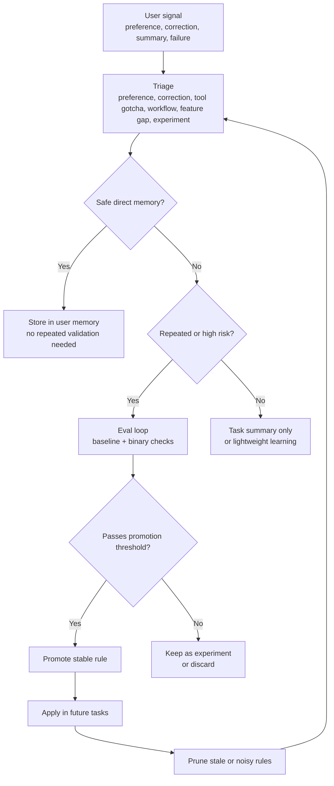
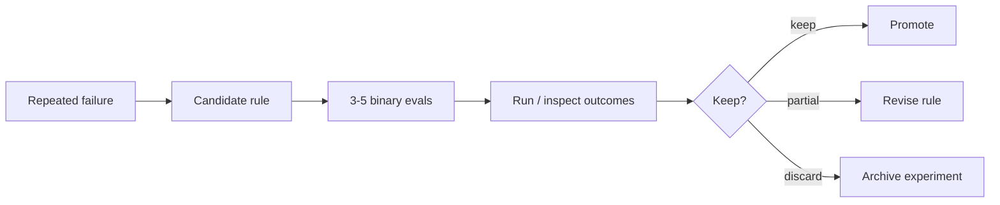

# Agent Evolution

> Turn corrections, preferences, task reflections, and repeated failures into durable agent operating knowledge.

[中文 README](README.zh.md) · English

Agent Evolution is a self-contained skill for agents that need to improve over time without turning their memory files into a noisy pile of one-off notes.

It gives your agent a practical evolution loop:

```text
Capture signal -> Triage intent -> Route storage -> Validate risky changes -> Promote stable rules -> Prune stale rules
```

It works with Codex, Claude Code, OpenClaw, and other agents that can load skill-style Markdown instructions.

---

## Why Use This Skill?

Most agents make the same mistakes because learnings stay trapped in chat history:

- User preferences are mentioned once, then forgotten.
- Corrections are treated as local fixes, not future rules.
- Task summaries describe what happened, but do not extract reusable lessons.
- Repeated failures become bigger prompts instead of tested guardrails.
- Trigger phrases keep getting added, but old or noisy ones are never removed.

Agent Evolution turns those moments into an explicit operating system for improvement.

---

## Design Philosophy

Agent Evolution is inspired by Andrej Karpathy's Software 3.0 / LLM OS framing and the broader context engineering discussion: LLM behavior is increasingly shaped by natural-language instructions, context, tools, memory, and evaluation, not only by traditional code.

In that framing, an agent's real "program" is not a single prompt. It is the context system around the model:

```text
instructions + memory + tools + examples + feedback + evals + pruning
```

Agent Evolution turns that idea into a small, operational skill:

- Context is treated as an editable runtime, not a pile of notes.
- User feedback becomes structured operating knowledge.
- Repeated failures become eval-backed rule candidates.
- Trigger phrases evolve through a lifecycle instead of growing forever.
- Human confirmation stays in the loop for high-impact changes.

This project is not affiliated with or endorsed by Andrej Karpathy, Anthropic, LangChain, or Shopify. It borrows the engineering lens: in the Software 3.0 era, improving an agent means engineering its context, memory, tools, feedback loops, and validation surfaces.

References:

- Andrej Karpathy, [Software Is Changing (Again)](https://www.youtube.com/watch?v=LCEmiRjPEtQ), YC AI Startup School.
- Andrej Karpathy, [Software 2.0](https://karpathy.medium.com/software-2-0-a64152b37c35).
- Tobi Lutke, [context engineering over prompt engineering](https://x.com/tobi/status/1935533422589399127).
- Anthropic, [Effective context engineering for AI agents](https://www.anthropic.com/engineering/effective-context-engineering-for-ai-agents).
- LangChain, [Context Engineering for Agents](https://www.langchain.com/blog/context-engineering-for-agents).
- LangChain, [How agents can use filesystems for context engineering](https://www.langchain.com/blog/how-agents-can-use-filesystems-for-context-engineering).

---

## What It Can Do

| Capability | What it handles | Output |
|---|---|---|
| Direct memory | "Remember this", "My style is...", "Always..." | A stable user memory without slow repeated validation |
| Task reflection | End-of-task summaries | `Evolution Reference` with reusable learnings and next-time cautions |
| Error learning | User corrections and repeated mistakes | Classified correction, workflow rule, or eval candidate |
| Eval loop | Repeated or risky failures | Binary evals, baseline failure, candidate rule, promotion threshold |
| Rule promotion | Stable operating lessons | Short rules for the host agent's instruction, tool-notes, skill, or memory files |
| Pruning | Stale, duplicated, vague, or conflicting rules | Keep, merge, demote, archive, or delete decision |
| Trigger governance | New, missed, or noisy trigger phrases | Add, modify, merge, demote, or remove trigger patterns |

---

## Core Workflow



The point is not to remember everything. The point is to route the right signal to the right level.

---

## The Update Mechanism

Agent Evolution uses different paths for different kinds of learning.

### 1. Direct Memory

Explicit user preferences should not wait for three repeated observations.

Example:

```text
Remember: my writing style is direct, practical, and avoids marketing language.
```

Expected behavior:

```text
Type: preference
Path: direct memory
Validation: not required
Destination: host agent's user memory location
```

### 2. Reflection Extraction

At the end of a meaningful task, the agent should separate normal closeout from reusable evolution material.

```markdown
## Evolution Reference

- Reusable learning:
- User preference:
- Tool or environment gotcha:
- Next time avoid:
- Suggested rule update: yes/no, because:
```

### 3. Eval Loop

Repeated failures and high-impact behavior changes should be tested before becoming strong rules.



### 4. Trigger Evolution

Trigger phrases are not just appended forever. They have a lifecycle:

```text
candidate -> active -> promoted -> deprecated -> removed
```

Supported operations:

```text
add
modify
merge
demote
remove
```

This prevents the skill from becoming over-eager as more trigger phrases accumulate.

---

## Storage Routing

Agent Evolution is host-neutral. It does not assume one fixed memory path.

| Signal | Preferred destination |
|---|---|
| User preference or writing style | Host agent's user memory |
| Workspace behavior rule | Host-supported agent instruction file |
| Tool gotcha | Tool notes file or relevant skill reference |
| Skill-specific behavior | That skill's `SKILL.md` or reference files |
| Repeated failure | `.learnings/ERRORS.md` and possibly `.learnings/EXPERIMENTS.md` |
| Feature gap | `.learnings/FEATURE_REQUESTS.md` |
| One-off task note | Task summary only |

---

## Install

Clone the repository:

```bash
git clone https://github.com/chemny/agent-evolution.git
```

Then place or symlink the repository into the skills directory used by your agent. Keep `SKILL.md` at the skill root.

If your skill manager supports GitHub installs, install this repository as a single skill.

---

## Usage Examples

### Record a preference

```text
Remember: my writing style is plain, direct, and example-driven.
```

### Summarize a completed task

```text
Summarize this task and extract the lessons worth keeping for future work.
```

### Handle a repeated error

```text
This mistake happened three times. Design an eval loop to test whether a new rule prevents it.
```

### Improve trigger behavior

```text
The phrase "handle it" is too broad and causes false triggers. "Always handle similar cases this way" should be treated as a memory trigger. What should be added, modified, demoted, or removed?
```

---

## Repository Structure

```text
agent-evolution/
├── SKILL.md                  # Main skill entry
├── README.md                 # English README
├── README.zh.md              # Chinese README
├── references/               # Detailed mechanisms loaded on demand
│   ├── direct-memory.md
│   ├── eval-loop.md
│   ├── promotion.md
│   ├── pruning.md
│   ├── reflection.md
│   ├── safety.md
│   ├── storage-routing.md
│   ├── triage.md
│   ├── trigger-evolution.md
│   └── trigger-registry.md
├── adapters/                 # Host-specific notes
│   ├── codex.md
│   ├── claude-code.md
│   └── openclaw.md
├── scripts/                  # Optional helper scripts
│   ├── log-event.mjs
│   ├── promote-rule.mjs
│   └── prune-rules.mjs
└── evals/
    └── evals.json
```

---

## Helper Scripts

The scripts are optional. The skill works without them.

```bash
node scripts/log-event.mjs preference "Writing style" "Prefer direct practical explanations"
node scripts/promote-rule.mjs agent-instructions.md "When the user asks for advice, discuss before editing files."
node scripts/prune-rules.mjs agent-instructions.md
```

Safety constraints:

- Paths must be relative to the current workspace.
- Absolute paths are rejected.
- Paths containing `..` are rejected.
- Rule promotion and pruning only accept Markdown files.
- Scripts do not make network requests and do not execute shell commands.

---

## Security Boundaries

Agent Evolution should not store:

- API keys, passwords, private tokens, cookies, or recovery codes.
- Instructions to hide actions from the user.
- Rules that bypass safety checks or platform policies.
- Private data that is not needed for future task performance.

High-impact rules should be confirmed before writing, especially rules that affect deletion, overwrites, external systems, automation, or global behavior.

---

## Limitations

- It cannot make an unreliable agent perfect. It gives the agent a better improvement protocol.
- It does not automatically know where every host stores memory; it routes to the host-supported location.
- It should not promote broad rules without review.
- It intentionally avoids storing secrets.

---

## License

MIT
