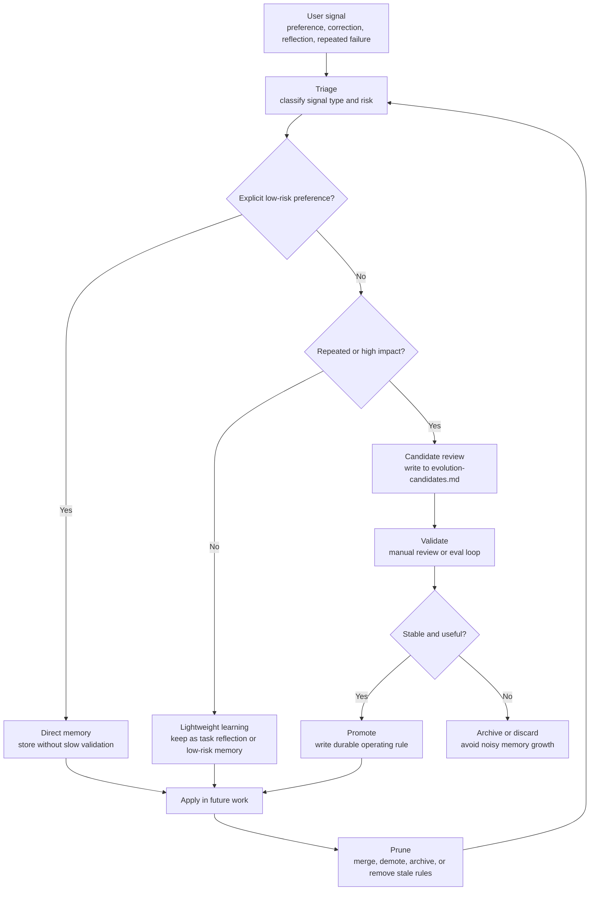

# Agent Evolution

> A self-evolving skill that turns user corrections, preferences, task reflections, repeated mistakes, and workflow lessons into durable agent operating knowledge.

[中文 README](README.zh.md) | English

Agent Evolution is a single-skill package for agents that need to improve over time without depending on a pile of manual notes or fragile prompt tweaks.

It gives your agent a practical evolution loop:

```text
Capture signal -> Triage -> Risk-grade -> Store -> Auto-promote safe learnings -> Review risky changes -> Prune stale rules
```

It supports Codex, Claude Code, OpenClaw, and generic agent environments that can load local `SKILL.md`-style instructions.

---

## What Problem It Solves

Most agents do not truly improve from experience:

- User preferences are mentioned once, then forgotten.
- Corrections fix the current answer but do not affect future behavior.
- Repeated mistakes keep happening because no rule is promoted.
- Task summaries describe what happened but do not extract reusable lessons.
- Trigger phrases keep growing, but stale or noisy triggers are never cleaned up.
- Memory files become noisy because everything is stored at the same level.

Agent Evolution gives the agent a structured way to decide:

- What should be remembered immediately.
- What should be only a candidate.
- What is safe to auto-promote.
- What must require human confirmation.
- What should be archived or pruned.

---

## Design Philosophy

Agent Evolution is inspired by Andrej Karpathy's Software 3.0 / LLM OS framing and the broader context engineering discussion: LLM behavior is increasingly shaped by natural-language instructions, context, tools, memory, examples, feedback, evaluation, and pruning, not only by traditional code.

In that framing, an agent's real "program" is not a single prompt. It is the context system around the model:

```text
instructions + memory + tools + examples + feedback + evals + pruning
```

Agent Evolution turns that idea into a small, operational skill:

- Context is treated as an editable runtime, not a pile of notes.
- User feedback becomes structured operating knowledge.
- Low-risk learnings can be promoted automatically.
- Repeated failures become eval-backed rule candidates.
- Trigger phrases evolve through a lifecycle instead of growing forever.
- Human confirmation stays in the loop for high-impact changes.

This project is not affiliated with or endorsed by Andrej Karpathy, Anthropic, LangChain, or Shopify. It borrows the engineering lens: in the Software 3.0 era, improving an agent means engineering its context, memory, tools, feedback loops, validation surfaces, and pruning mechanisms.

References:

- Andrej Karpathy, [Software Is Changing (Again)](https://www.youtube.com/watch?v=LCEmiRjPEtQ), YC AI Startup School.
- Andrej Karpathy, [Software 2.0](https://karpathy.medium.com/software-2-0-a64152b37c35).
- Tobi Lutke, [context engineering over prompt engineering](https://x.com/tobi/status/1935533422589399127).
- Anthropic, [Effective context engineering for AI agents](https://www.anthropic.com/engineering/effective-context-engineering-for-ai-agents).
- LangChain, [Context Engineering for Agents](https://www.langchain.com/blog/context-engineering-for-agents).
- LangChain, [How agents can use filesystems for context engineering](https://www.langchain.com/blog/how-agents-can-use-filesystems-for-context-engineering).

---

## What It Can Do

| Capability | What It Handles | Output |
|---|---|---|
| Direct memory | Explicit user preferences such as "remember this" or "always do X" | Stable user memory |
| Task reflection | Completed work, summaries, repeated workflows | Reusable lessons |
| Error learning | User corrections and repeated mistakes | Candidate or promoted rule |
| Tool gotchas | Paths, command failures, environment issues | Tool/workflow memory |
| Risk grading | Low / medium / high risk classification | Auto-promote or review |
| Rule promotion | Stable lessons become durable behavior | Memory or instruction update |
| Trigger governance | Missed triggers and false triggers | Trigger lifecycle management |
| Pruning | Stale, duplicate, or conflicting rules | Keep, merge, demote, archive, remove |

---

## Core Workflow



---

## Self-Running Mechanism

Agent Evolution has three startup levels:

```text
metadata-trigger
  The host loads the skill when SKILL.md matches the user request.

opportunistic-self-start
  Once loaded, the skill runs lightweight checks after significant work, corrections, tool failures, or repeated issues.

scheduled-reflection-adapter
  Optional background scan through Codex automation, cron, heartbeat, hooks, or another host scheduler.
```

When installed in Codex, Agent Evolution can create a 6-hour graded scan automation:

```text
Every 6 hours
-> scan recent bounded session logs
-> extract useful learnings
-> auto-promote low-risk learnings
-> write medium/high-risk items to review candidates
-> never auto-edit global rules, skills, external systems, or secrets
```

---

## Risk-Graded Auto-Promotion

Agent Evolution does not treat all learnings equally.

### Low Risk: Auto-Promote

Low-risk learnings can be automatically written to `evolution.md`.

Examples:

- Explicit user preferences.
- User-corrected low-risk behavior.
- Stable local path or tool gotchas.
- Repeated small workflow mistakes with clear fixes.

Example:

```markdown
Rule:
- When installing user-managed skills, default to `~/.agents/skills` unless the user explicitly names another directory.
```

### Medium Risk: Candidate Review

Medium-risk learnings go to `evolution-candidates.md`.

Examples:

- Changes to default workflow.
- Skill routing or trigger phrasing changes.
- Behavior that affects several task types.
- Inferred patterns without explicit user confirmation.

### High Risk: Requires Confirmation

High-risk learnings are never auto-promoted.

Examples:

- File deletion or overwrite behavior.
- GitHub push, publish, sync, or repository changes.
- Feishu/Lark, email, posting, or other external systems.
- Credentials, tokens, cookies, secrets.
- Automation behavior.
- Global instruction files such as `AGENTS.md`.
- Skill file edits.
- Broad cross-agent behavior changes.

---

## Installed Memory Files

Agent Evolution uses three memory files:

```text
evolution.md
  Low-risk auto-promoted learnings.

evolution-candidates.md
  Medium/high-risk learnings waiting for review.

evolution-promotions.md
  Audit log for automatic promotions.
```

This creates a feedback loop without letting the agent rewrite high-impact rules without review.

---

## Install

Agent Evolution is a single-skill repository with a lightweight installer.

The installer uses minimal dependencies:

- `bash`
- `mkdir`
- `cp`
- `tar`
- `curl` only for one-line remote install

No database. No Docker. No browser automation. No npm install. No external API. No GitHub token.

### One-Line Install

```bash
curl -fsSL https://raw.githubusercontent.com/chemny/agent-evolution/main/install.sh | bash
```

### What The Installer Does

The installer:

1. Installs the skill to:

```text
~/.agents/skills/agent-evolution
```

2. Creates memory templates:

```text
evolution.md
evolution-candidates.md
evolution-promotions.md
```

3. Detects supported host environments:

- Codex
- Claude Code
- OpenClaw
- Generic CLI

4. For Codex, creates a 6-hour graded scan automation:

```text
~/.codex/automations/agent-evolution-graded-scan/automation.toml
```

5. For Claude Code, OpenClaw, and generic environments, installs adapter prompts and memory templates.

---

## Platform Support

| Platform | Core Skill | Memory Templates | 6-Hour Background Scan | Low-Risk Auto-Promotion |
|---|---:|---:|---:|---:|
| Codex | yes | yes | yes, via Codex automation | yes |
| OpenClaw | yes | yes | if host scheduler is available | yes, when scheduled |
| Claude Code | yes | yes | if hooks or cron are available | yes, when scheduled |
| Generic CLI | yes | yes | only with `AGENT_EVOLUTION_SCAN_COMMAND` | command-dependent |

Background self-running is a host capability.

The skill provides adapters and templates, but each platform must have a way to run scheduled jobs.

---

## Verify Install

After installation, run:

```bash
~/.agents/skills/agent-evolution/scripts/verify-install.sh
```

Then start a fresh agent session and test:

```text
Use agent-evolution: remember that my writing style is direct and example-driven. Do not write files; just explain how you would handle this memory.
```

Expected behavior:

```text
Path: direct memory
Validation: not required
Destination: host agent user memory
```

---

## Usage Examples

### Remember A Preference

```text
Remember: my writing style is direct, practical, and avoids marketing language.
```

Expected handling:

```text
Type: preference
Risk: low
Action: store as user memory
```

### Learn From A Correction

```text
You made the same directory-sync mistake again. Do not use the old sync logic anymore.
```

Expected handling:

```text
Type: correction
Risk: low or medium depending on scope
Action: auto-promote if local and explicit; otherwise write candidate
```

### Reflect After A Task

```text
Summarize what should be learned from this task.
```

Expected output:

```markdown
## Evolution Reference

- Reusable learning:
- User preference:
- Tool or environment gotcha:
- Next time avoid:
- Suggested rule update:
```

### Handle A High-Risk Rule

```text
From now on, automatically delete old duplicate skills.
```

Expected handling:

```text
Risk: high
Action: write candidate only
Reason: deletion behavior requires confirmation
```

---

## File Structure

```text
agent-evolution/
├── SKILL.md
├── install.sh
├── README.md
├── README.zh.md
├── LICENSE
├── templates/
│   ├── evolution.md
│   ├── evolution-candidates.md
│   ├── evolution-promotions.md
│   ├── codex-automation.toml
│   └── generic-scan-prompt.md
├── adapters/
│   ├── codex.md
│   ├── claude-code.md
│   └── openclaw.md
├── scripts/
│   ├── detect-platform.sh
│   ├── install-codex.sh
│   ├── install-claude-code.sh
│   ├── install-openclaw.sh
│   ├── install-generic-cron.sh
│   ├── verify-install.sh
│   ├── log-event.mjs
│   ├── promote-rule.mjs
│   └── prune-rules.mjs
├── references/
│   ├── direct-memory.md
│   ├── eval-loop.md
│   ├── memory-layers.md
│   ├── promotion.md
│   ├── pruning.md
│   ├── reflection.md
│   ├── safety.md
│   ├── self-start.md
│   ├── storage-routing.md
│   ├── triage.md
│   ├── trigger-evolution.md
│   └── trigger-registry.md
└── evals/
    └── evals.json
```

---

## Safety Boundaries

Agent Evolution will not automatically:

- Store secrets, tokens, cookies, passwords, or private keys.
- Delete files.
- Overwrite existing files.
- Push, publish, sync, or change GitHub repositories.
- Operate external systems such as Feishu/Lark, email, social platforms, or production services.
- Change global instruction files.
- Edit skill files.
- Change automation behavior.
- Promote broad behavior changes without review.

High-impact changes are written to candidates and require confirmation.

---

## Update

Re-run the installer:

```bash
curl -fsSL https://raw.githubusercontent.com/chemny/agent-evolution/main/install.sh | bash
```

Then start a fresh agent session if your host scans skills only at startup.

---

## License

See `LICENSE`.
