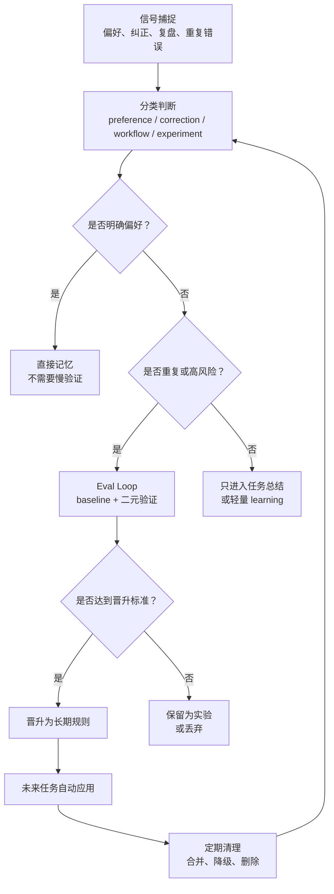
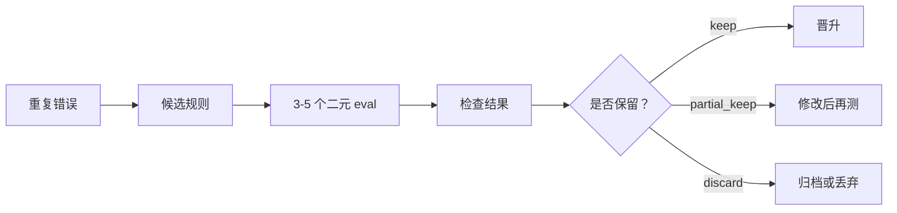

# Agent Evolution

> 把用户偏好、纠正、任务复盘、重复错误和工具坑，沉淀成 Agent 以后能真正使用的操作知识。

中文 · [English README](README.md)

Agent Evolution 是一个自包含的 Agent 进化 skill。它不是简单的「记忆插件」，而是一套轻量的进化流程：什么该直接记住，什么只放在任务总结里，什么需要验证，什么可以升级成规则，什么应该被清理。

一句话：

```text
让 Agent 不只是完成这一次任务，而是从这一次任务里学会下一次怎么做得更好。
```

适用于 Codex、Claude Code、OpenClaw，以及其他支持 skill / Markdown 指令 / 本地知识文件的 Agent 环境。

---

## 为什么需要这个 skill？

很多 Agent 不是不会做事，而是不会稳定地「积累经验」。

常见问题是：

- 用户说过的偏好，过几天就忘了。
- 用户纠正了一次错误，下次还是再犯。
- 任务总结只写「做了什么」，没有提取「下次怎么做」。
- 重复错误只靠更长 prompt 解决，没有验证机制。
- 触发词越加越多，最后误触发、乱触发。
- 规则文件越写越乱，没有降级和删除机制。

Agent Evolution 解决的是这些问题：

```text
把聊天里的零散反馈，变成可分类、可验证、可升级、可清理的长期操作知识。
```

---

## 设计思想：借鉴 Karpathy 的 Software 3.0 / LLM OS 思路

Agent Evolution 的底层思路，借鉴了 Andrej Karpathy 关于 Software 3.0 / LLM OS 的判断，也参考了 Anthropic、LangChain 等团队关于 context engineering 的讨论：在大模型时代，Agent 的行为不只由传统代码决定，也越来越由自然语言指令、上下文、工具、记忆、反馈和验证机制共同决定。

换句话说，Agent 真正的「程序」不只是一句 prompt，而是它周围的上下文系统：

```text
instructions + memory + tools + examples + feedback + evals + pruning
```

Agent Evolution 做的事情，就是把这个思路落成一个可执行的 skill：

- 把 context 当成可维护的运行时，而不是聊天记录的堆积。
- 把用户反馈变成结构化操作知识。
- 把重复错误变成可验证的候选规则。
- 把触发词当成需要治理的接口，而不是无限追加关键词。
- 对高影响规则保留人工确认，不让 Agent 自动乱升级。

这不是 Karpathy、Anthropic、LangChain 或 Shopify 参与或背书的项目，而是借鉴这些公开讨论里的工程视角：在 Software 3.0 时代，改进 Agent 的关键，不只是写更长的 prompt，而是工程化管理它的上下文、记忆、工具、反馈闭环和验证面。

参考：

- Andrej Karpathy, [Software Is Changing (Again)](https://www.youtube.com/watch?v=LCEmiRjPEtQ), YC AI Startup School.
- Andrej Karpathy, [Software 2.0](https://karpathy.medium.com/software-2-0-a64152b37c35).
- Tobi Lutke, [context engineering over prompt engineering](https://x.com/tobi/status/1935533422589399127).
- Anthropic, [Effective context engineering for AI agents](https://www.anthropic.com/engineering/effective-context-engineering-for-ai-agents).
- LangChain, [Context Engineering for Agents](https://www.langchain.com/blog/context-engineering-for-agents).
- LangChain, [How agents can use filesystems for context engineering](https://www.langchain.com/blog/how-agents-can-use-filesystems-for-context-engineering).

---

## 装上后能做什么？

| 能力 | 解决什么问题 | 输出结果 |
|---|---|---|
| 直接记忆 | 用户明确说「记住」「以后都」「我的风格是」 | 直接写入用户记忆，不必等多次观察 |
| 任务复盘 | 任务完成后总结哪些值得沉淀 | `Evolution Reference` 进化参考区 |
| 错误沉淀 | 用户纠正、重复犯错、理解偏差 | 分类为 correction、workflow、experiment 等 |
| Eval 验证 | 重复错误或高风险规则不能直接升级 | baseline + 二元 eval + 晋升阈值 |
| 规则晋升 | 稳定经验变成长期执行规则 | 写入宿主 Agent 支持的 instruction / tool notes / skill / memory |
| 清理机制 | 规则变多后重复、冲突、过期 | keep / merge / demote / archive / delete |
| 触发词治理 | 不同用户表达习惯不同 | add / modify / merge / demote / remove |

---

## 核心流程



它的重点不是「什么都记住」，而是：

```text
不同信号走不同通道，不同知识放到不同层级。
```

---

## 工作原理

Agent Evolution 把一次反馈拆成 7 步。

```text
Signal → Triage → Route → Store → Validate → Promote → Prune
```

### 1. Signal：捕捉信号

触发来源包括：

- 用户明确要求记住
- 用户指出错误
- 任务结束要求总结
- 同类问题重复发生
- 工具或环境出现坑
- 某条规则需要验证
- 某个触发词误触发或漏触发

### 2. Triage：分类判断

信号会被分类：

```text
preference       用户偏好
correction       用户纠正
tool_gotcha      工具坑
workflow         工作流经验
feature_gap      能力缺口
experiment       需要验证的问题
archive_only     只留历史，不形成规则
```

### 3. Route：选择存储位置

它不假设固定路径，而是按宿主 Agent 环境选择：

| 信号 | 建议位置 |
|---|---|
| 用户写作风格 / 协作偏好 | 用户记忆文件 |
| 项目执行规则 | 项目的 agent instruction 文件 |
| 工具坑 | tool notes 或相关 skill reference |
| skill 行为规则 | 对应 skill 的 `SKILL.md` 或 references |
| 重复错误 | `.learnings/ERRORS.md` / `.learnings/EXPERIMENTS.md` |
| 功能缺口 | `.learnings/FEATURE_REQUESTS.md` |
| 一次性上下文 | 只放任务总结 |

### 4. Store：写入

明确偏好可以直接写入。

比如：

```text
记住：我的写作风格是先讲人话，再讲方法，不要堆概念。
```

它应该走：

```text
类型：preference
路径：direct memory
是否需要反复验证：不需要
目标：宿主 Agent 的用户记忆位置
```

### 5. Validate：验证

如果是重复错误或高风险规则，不能直接写成强规则。

需要进入 eval loop：



例子：

```text
问题：用户只是问建议时，Agent 直接改了文件。
候选规则：用户问建议、诊断、方案时，先回答，不直接改文件。
验证：给 5 个测试场景，看是否都能正确区分建议和执行。
```

### 6. Promote：晋升

只有稳定、具体、可执行、未来有用的经验，才应该晋升成长期规则。

不要把这种话写成规则：

```text
以后要更小心。
```

应该写成：

```text
当用户询问建议、诊断、选项或「怎么做」时，先回答或给计划，不直接修改文件。
```

### 7. Prune：清理

清理不是附加功能，而是进化系统的一部分。

```text
keep      保留
merge     合并重复规则
demote    降级为普通记忆
archive   归档
delete    删除错误或过期规则
```

---

## 触发词更新机制

不同用户说话方式不同，不能只靠固定关键词。

但触发词也不能无限增加，否则会越来越乱。

Agent Evolution 使用触发词生命周期：

```text
candidate → active → promoted → deprecated → removed
```

支持五种操作：

```text
add       新增
modify    修改
merge     合并
demote    降级
remove    删除
```

举个例子：

| 触发词 | 判断 | 原因 |
---|---|---|
| 记住 | promoted | 明确记忆意图 |
| 以后类似情况按这个处理 | active / promoted | 明确未来适用范围 |
| 处理一下 | candidate / deprecated | 太宽泛，容易误触发 |
| 学一下 | deprecated | 可能是用户学习，也可能是让 Agent 记忆，语义不稳 |

核心原则：

```text
高频、清晰、稳定的触发词，才进入 SKILL.md description。
低频或个性化表达，先放 trigger-registry.md。
误触发的词，要降级或删除。
```

---

## 怎么安装？

克隆仓库：

```bash
git clone https://github.com/chemny/agent-evolution.git
```

然后把这个目录放到你的 Agent skills 目录里。关键是让 `SKILL.md` 位于 skill 根目录。

如果你的 skill 管理器支持从 GitHub 安装，可以直接把这个仓库作为单个 skill 安装。

---

## 怎么使用？

### 记录个人偏好

```text
记住：我的写作风格是先讲人话，再讲方法，不要堆概念。
```

### 任务结束后提取进化参考

```text
总结这次任务，提取哪些经验值得沉淀，哪些不应该写成长期规则。
```

### 重复错误进入验证流程

```text
这个错误已经出现三次了，帮我设计 eval loop，看看新规则能不能避免它。
```

### 管理触发词

```text
「处理一下」这个触发词太宽泛，容易误触发；但「以后类似情况按这个处理」可以作为记忆触发。
```

### 判断是否应该晋升规则

```text
这条经验适合写进长期规则吗？如果适合，应该写到哪里？
```

---

## 安全边界

这个 skill 不应该记录：

- API key、密码、私有 token、cookie、恢复码
- 要求 Agent 隐藏行为的规则
- 绕过安全检查或平台策略的规则
- 对未来任务没有必要的私人数据

高影响规则需要确认，比如：

- 删除或覆盖文件
- 修改外部系统
- 改变自动化行为
- 降低确认要求
- 应用于所有项目或所有 Agent 的全局规则

附带的脚本也做了路径限制：

- 只接受当前 workspace 内的相对路径
- 禁止绝对路径
- 禁止 `..`
- `promote-rule` 和 `prune-rules` 只接受 Markdown 文件
- 不联网，不执行 shell 命令

---

## 仓库结构

```text
agent-evolution/
├── SKILL.md                  # skill 主入口
├── README.md                 # 英文 README
├── README.zh.md              # 中文 README
├── references/               # 按需读取的机制文档
│   ├── direct-memory.md
│   ├── eval-loop.md
│   ├── promotion.md
│   ├── pruning.md
│   ├── reflection.md
│   ├── safety.md
│   ├── storage-routing.md
│   ├── triage.md
│   ├── trigger-evolution.md
│   └── trigger-registry.md
├── adapters/                 # 不同宿主 Agent 的适配说明
│   ├── codex.md
│   ├── claude-code.md
│   └── openclaw.md
├── scripts/                  # 可选辅助脚本
│   ├── log-event.mjs
│   ├── promote-rule.mjs
│   └── prune-rules.mjs
└── evals/
    └── evals.json
```

---

## 局限

- 它不是魔法。它不能让一个不可靠的 Agent 立刻变完美。
- 它不强行假设所有 Agent 的记忆路径一致。
- 它不会自动把所有总结都写成长期规则。
- 它不应该保存敏感信息。
- 它需要在真实任务里持续调触发词和规则质量。

---

## License

MIT
